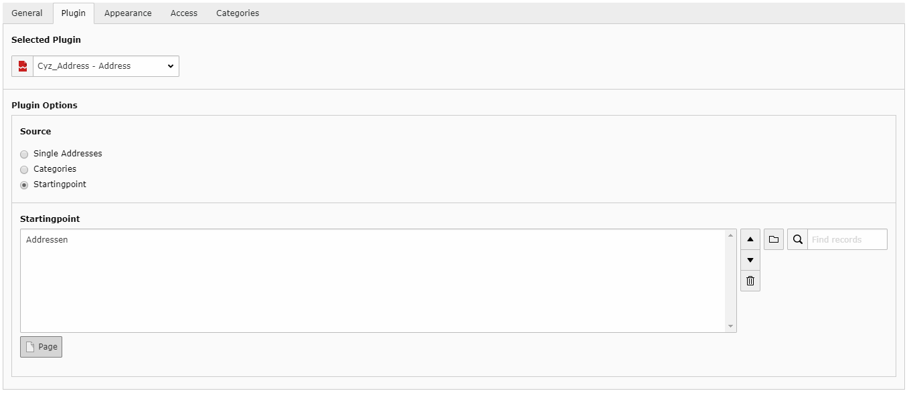

.. ==================================================
.. FOR YOUR INFORMATION
.. --------------------------------------------------
.. -*- coding: utf-8 -*- with BOM.

.. include:: ../Includes.txt

.. _introduction:

Introduction
============

What does it do?
----------------
The extension provides a plugin which allows to use fluid templates with tt_address.
It provides the same selection mechanisms as tt_address, the only difference being that only one type of selection is active at a time.

It also features a realurl auto configuration, configurable pages for single and list view action and layout template selection in backend.

Screenshots
-----------

This is the plugin with the page selector active.

