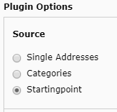

.. ==================================================
.. FOR YOUR INFORMATION
.. --------------------------------------------------
.. -*- coding: utf-8 -*- with BOM.

.. include:: ../Includes.txt

.. _users-manual:

Users manual
============

Source selection
----------------
As mentioned in the introduction, only one type of source selection is active at a time.
The source selection must be selected via the radio buttons in the "source" form.

"Startingpoint" (single pages) selected as source

Switchable Layout Templates
---------------------------
Under the "Layout template" tab in the plugin flexform, a layout can be selected from a list of layouts defined in TSConfig.

::

    tx_cyzaddress.layouts {
        value1 = layoutName1
        value2 = layoutName2
    }

The selected layout value is then accessible in the view via *{settings.layout}*. For an example see the default show template.

List and Single View Pages
--------------------------

In order to assign the list view or the single view to a different page, the plugin flexform provides a tab "Target Pages" which allows to select one page each for the single view and the list view.

The single view page uid and the list view page uid can be accessed via *{settings.singleViewPageUid}* and *{settings.listViewPageUid}* respectively.

Example from the default show template:

::

    <f:link.action action="list" pageUid="{settings.listViewPageUid}">
        <f:translate key="LLL:EXT:..."/>
    </f:link.action>

tt_content fields
-----------------

The  *{data}* view variable provides access to tt_content fields.